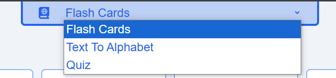
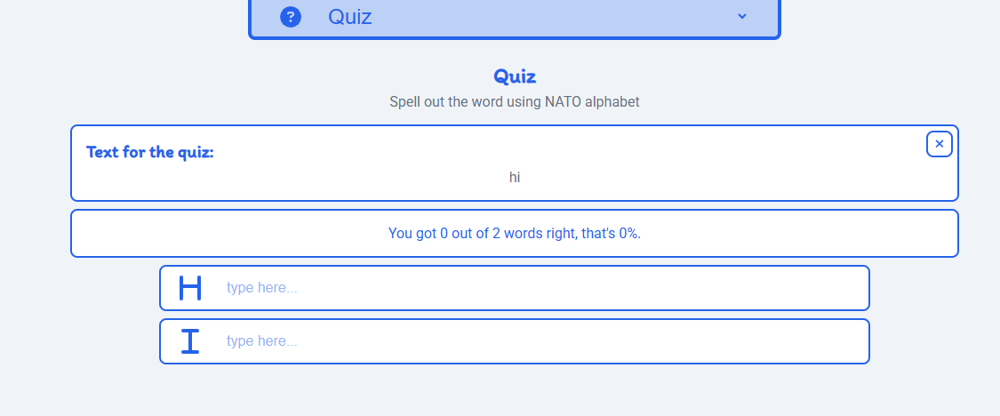

# The NATO Speller

This project was created to learn the NATO alphabet. You can use the flashcards to study. You can translate texts into the NATO alphabet and test yourself in the quiz.


## Navigate

To navigate through the React app, click on the text in the header and you will get a dropdown to navigate to another page.

**Important: Texts and quizzes are not saved when you change pages.**



## Pages

### Flash Cards

Flashcards are cards for learning the words behind the letters.


### Text To Alphabet

Text To Alphabet offers the ability to quickly convert text into the NATO alphabet.

**Important characters like ß, ö, ä, ü, and other special characters are replaced with ??**

*By clicking on the trash (top right corner) can you can stop the translation or start again*


### Quiz

In the quiz you have the option of entering a text and you are then asked how to spell it in the NATO alphabet.

*By clicking on the X (top right corner) the quiz can be ended or started again*




## How to Clone and Run the Project

1.  First, copy the GitHub download link.

    ```bash
    git clone https://github.com/DigitaleWeltLibrary/the-nato-speller.git
    ```

2.  Then, the repository will be cloned into your directory.

3.  After that, you need to install the Node.js packages.

    ```bash
    npm install
    ```

4.  You're now ready to start the app\!

    ```bash
    npm run dev
    ```

## Used Technologies

  * Vite
  * React
  * FontAwesomeIcon

## Versions
- V1.0: Full functionality with UI
- V2.0: Full UI redesign
